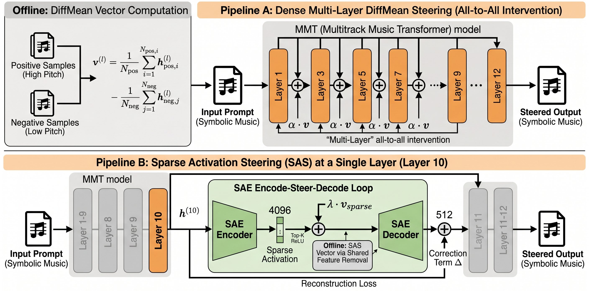

<script type="text/javascript" async
  src="https://cdnjs.cloudflare.com/ajax/libs/mathjax/3.2.2/es5/tex-mml-chtml.min.js">
</script>

<style>
  audio { width: 100%; max-width: 360px; }
  .audio-grid { display: grid; grid-template-columns: 1fr 1fr; gap: 16px; margin: 12px 0 24px 0; }
  .audio-grid.three-col { grid-template-columns: 1fr 1fr 1fr; }
  .audio-cell { background: #f6f8fa; border-radius: 8px; padding: 12px; text-align: center; }
  .audio-cell strong { display: block; margin-bottom: 6px; font-size: 0.9em; }
  .audio-cell em { display: block; margin-bottom: 8px; font-size: 0.8em; color: #586069; }
  .method-badge { display: inline-block; padding: 2px 8px; border-radius: 4px; font-size: 0.75em; font-weight: bold; margin-right: 4px; }
  .badge-dm { background: #ddf4ff; color: #0969da; }
  .badge-sas { background: #dafbe1; color: #1a7f37; }
  .badge-smooth { background: #fff8c5; color: #9a6700; }
  .results-table { width: 100%; border-collapse: collapse; margin: 12px 0; font-size: 0.9em; }
  .results-table th, .results-table td { padding: 8px 12px; border: 1px solid #d0d7de; text-align: center; }
  .results-table th { background: #f6f8fa; }
  .results-table tr:hover { background: #f6f8fa; }
  .highlight-row { background: #dafbe1 !important; }
  h3 { margin-top: 32px; }
  .section-divider { border: none; border-top: 2px solid #d0d7de; margin: 40px 0; }
  .toc { background: #f6f8fa; border-radius: 8px; padding: 16px 24px; margin: 20px 0; }
  .toc ul { margin: 0; padding-left: 20px; }
  .toc li { margin: 4px 0; }
  .key-finding { background: #fff8c5; border-left: 4px solid #9a6700; padding: 12px 16px; margin: 16px 0; border-radius: 0 8px 8px 0; }
  .pipeline-figure { text-align: center; margin: 24px 0; }
  .pipeline-figure img { max-width: 100%; border: 1px solid #d0d7de; border-radius: 8px; }
  .pipeline-figure figcaption { font-size: 0.85em; color: #586069; margin-top: 8px; }
  @media (max-width: 700px) {
    .audio-grid, .audio-grid.three-col { grid-template-columns: 1fr; }
  }
</style>

# Dense vs Sparse Activation Steering for Interpretable Attribute Control in Symbolic Music Generation

**Authors:** Ioannis Prokopiou<sup>1,2</sup>, Pantelis Vikatos<sup>2</sup>, Maximos Kaliakatsos-Papakostas<sup>3</sup>, Theodoros Giannakopoulos<sup>4</sup>, Themos Stafylakis<sup>1,5</sup>

**Affiliations:**  
<sup>1</sup> Athens University of Economics and Business &nbsp;
<sup>2</sup> Orfium Research &nbsp;
<sup>3</sup> Hellenic Mediterranean University &nbsp;
<sup>4</sup> NCSR "Demokritos" &nbsp;
<sup>5</sup> Archimedes / Athena R.C.

*Proceedings of the 27th International Society for Music Information Retrieval Conference (ISMIR), Abu Dhabi, UAE, November 2026*

<div style="text-align: center; margin: 20px 0;">
  <a href="https://github.com/salu133445/mmt" class="btn">💻 Code Repository</a>
</div>

---

<div class="toc">
<strong>Contents</strong>
<ul>
  <li><a href="#abstract">Abstract</a></li>
  <li><a href="#pipeline">Pipeline Overview</a></li>
  <li><a href="#methods">Methodology</a></li>
  <li><a href="#results">Experimental Results</a>
    <ul>
      <li><a href="#single-results">Single-Attribute Control</a></li>
      <li><a href="#dual-results">Dual Steering Comparison</a></li>
      <li><a href="#conditioned-results">Conditioned Dual Steering</a></li>
      <li><a href="#fmd-results">Fréchet Music Distance</a></li>
      <li><a href="#smooth-results">Temporal Dynamics</a></li>
      <li><a href="#perceptual-results">Perceptual Evaluation</a></li>
    </ul>
  </li>
  <li><a href="#audio-examples">Audio Examples</a>
    <ul>
      <li><a href="#single-pitch">Single Attribute — Pitch</a></li>
      <li><a href="#single-duration">Single Attribute — Duration</a></li>
      <li><a href="#dual-steering">Dual Steering (Pitch + Duration)</a></li>
      <li><a href="#smooth-steering">Smooth vs Abrupt Steering</a></li>
    </ul>
  </li>
  <li><a href="#code">Code & Reproducibility</a></li>
  <li><a href="#citation">Citation</a></li>
  <li><a href="#references">References</a></li>
</ul>
</div>

---

## Abstract {#abstract}

Transformer-based architectures have revolutionized symbolic music generation, yet achieving fine-grained, interpretable control over discrete signal attributes without model retraining remains a challenge. This paper presents a comprehensive comparison of inference-time activation steering methodologies within the Multitrack Music Transformer (MMT) [1]. We contrast the **Difference-in-Means (DiffMean)** dense steering approach with a **Sparse Activation Steering (SAS)** framework utilizing Sparse Autoencoders (SAEs) [10]. We systematically evaluate both methods across single and dual conditioned/unconditioned generation tasks for **Pitch** and **Duration**. We introduce a **beat-wise smooth steering** mechanism that mitigates contextual disruption. Finally, we assess generation fidelity using **Fréchet Music Distance** (FMD) [29] and a human vs LLM-based qualitative evaluation pipeline (**Music Flamingo** [31]) to compare steering efficiency and music audio quality.

---

## Pipeline Overview {#pipeline}

<div class="pipeline-figure">
  
  <figcaption><strong>Figure 1.</strong> Pipeline comparison: Dense multi-layer DiffMean (top) versus Sparse Activation Steering with SAE encode/re-sparsify/decode at a single layer (bottom).</figcaption>
</div>

<div class="key-finding">
<strong>Key insight:</strong> DiffMean injects dense 512-dim vectors at <em>all 12 layers</em> (All-to-All intervention). SAS decomposes activations into 4096 interpretable sparse features and steers at <em>a single layer</em> (Layer 10) — achieving a <strong>48× reduction</strong> in intervention footprint while providing monosemantic feature interpretability.
</div>

---

## Methodology {#methods}

### Model and Data

We utilize the pre-trained **Multitrack Music Transformer (MMT)** [1], a decoder-only architecture with a concurrent 6-tuple event representation: `(type, beat, position, pitch, duration, instrument)`. The model operates on a 512-dimensional residual stream across 12 layers, pre-trained on the **Symbolic Orchestral Database (SOD)** [32]. Contrastive sets are defined at the 20th/80th percentiles (average pitch ≤ 60 vs. ≥ 67.6 MIDI; average duration ≤ 6.5 vs. ≥ 14.5 ticks), yielding 1,280 non-overlapping samples per cluster.

### Dense Steering (DiffMean)

The DiffMean approach [9, 15, 16] extracts a steering vector representing the latent direction separating two contrasting concepts. For a given layer \\(\ell\\), the steering vector is the centroid difference between positive and negative sample activations:

$$\mathbf{v}^{(\ell)} = \frac{1}{N_{\text{pos}}} \sum_{i=1}^{N_{\text{pos}}} \mathbf{h}_{\text{pos},i}^{(\ell)} - \frac{1}{N_{\text{neg}}} \sum_{j=1}^{N_{\text{neg}}} \mathbf{h}_{\text{neg},j}^{(\ell)}$$

At inference, the hidden states are modified by injecting the steering vector scaled by a coefficient \\(\alpha\\):

$$\mathbf{h}_{\text{steer}}^{(\ell)} \leftarrow \mathbf{h}^{(\ell)} + \alpha \cdot \mathbf{v}^{(\ell)}$$

The distributed nature of dense embeddings requires **multi-layer reinforcement** — empirically, the All-to-All broadcast strategy proved optimal [7].

### Sparse Activation Steering (SAS)

The SAS framework [10] employs one SAE per transformer layer, projecting 512-dimensional dense activations into a 4096-dimensional sparse space (8× expansion) with a strict Top-K sparsity bottleneck and tied weights. An **Adaptive K Strategy** scales K linearly across layers (K=32 for Layer 0, up to K=128 for Layer 11).

SAS vectors are computed via frequency filtering with threshold \\(\tau = 0.08\\), followed by **Shared Feature Removal** (zeroing features active in both contrastive pools). At inference, the steering is applied in the sparse feature space:

$$\tilde{a}_\ell = \hat{a}_\ell\!\left(\sigma\!\left(f(a_\ell^t) + \lambda \cdot \mathbf{v}_{(b,\ell)}\right)\right) + \Delta$$

where \\(f(a_\ell^t)\\) is the sparse encoding, \\(\sigma\\) is the Top-K ReLU activation, \\(\hat{a}_\ell(\cdot)\\) is the SAE decoder, and \\(\Delta := a_\ell^t - \hat{a}_\ell(f(a_\ell^t))\\) is a **correction term** that compensates for reconstruction loss, ensuring the intervention shifts only the intended semantic concepts.

### Dual-Concept Steering

Multi-attribute steering exposes the fundamental divergence between dense and sparse geometries. In dense space, pitch and duration exhibit an average absolute cosine similarity of **0.49** (peaking at 0.81 in Layer 3), requiring geometric decoupling via **Gram-Schmidt Orthogonalization** (GSO). In sparse space, the average cosine similarity is **−0.27** (anti-correlated), but 51.8% average feature overlap causes Top-K resource competition during re-sparsification. We evaluate strategies combining mathematical decoupling and capacity expansion:

<table class="results-table">
  <thead>
    <tr><th>Strategy</th><th>Composition</th><th>Top-K</th><th>Overlap Resolution</th></tr>
  </thead>
  <tbody>
    <tr><td>Direct Addition</td><td>λ<sub>p</sub>v<sub>p</sub> + λ<sub>d</sub>v<sub>d</sub></td><td>Normal K</td><td>Assumes disjointness (fails)</td></tr>
    <tr><td>Cross-Concept Mask</td><td>Winner-take-all, then add</td><td>Normal K</td><td>Assignment by magnitude</td></tr>
    <tr><td>Expanded K 2×</td><td>λ<sub>p</sub>v<sub>p</sub> + λ<sub>d</sub>v<sub>d</sub></td><td>Doubled (2×K)</td><td>Increased capacity absorbs both</td></tr>
    <tr><td>GS + Expanded K 2×</td><td>GS orthogonalize v<sub>d</sub> w.r.t. v<sub>p</sub></td><td>Doubled (2×K)</td><td>Geometry + capacity</td></tr>
  </tbody>
</table>

### Smooth Steering Envelopes

To mitigate contextual disruption from abrupt activation patching, we modulate \\(\alpha(t)\\) using a **beat-wise cosine schedule** [35]:

$$\alpha_{\text{eff}}(t) = \begin{cases} \alpha \cdot \frac{1}{2}\left(1 - \cos\!\left(\frac{\pi \cdot t}{n_{\text{ramp}}}\right)\right) & t < n_{\text{ramp}} \\[4pt] \alpha & t \geq n_{\text{ramp}} \end{cases}$$

The beat-wise clock increments only upon musical beat changes, ensuring perceptually uniform transitions regardless of local polyphony.

### Quality Degradation Metric

Performance is quantified via **Steering Success** (directional shift relative to baseline) and **Quality Degradation** (\\(\delta\\)), computed as cumulative deviation from ground-truth SOD corpus statistics:

$$\delta = |H - H_0| + \max(0, S_0 - S) + \max(0, G_0 - G)$$

where \\(H_0 = 2.974\\) (Pitch Class Entropy), \\(S_0 = 92.26\%\\) (Scale Consistency), and \\(G_0 = 93.05\%\\) (Groove Consistency). Scale and Groove apply asymmetric penalties: increases above ground truth are neutral artifacts; decreases represent structural breakdown.

---

## Experimental Results {#results}

### Single-Attribute Control {#single-results}

Unconditioned trials with 50 generations across \\(\alpha \in [-2, +2]\\):

<table class="results-table">
  <thead>
    <tr><th>Method / Attr.</th><th>Variant (α = ±2.0)</th><th>Abs. Mean</th><th>Rel. Shift</th><th>Degrad (δ)</th></tr>
  </thead>
  <tbody>
    <tr><td><span class="method-badge badge-dm">Dense</span> Pitch</td><td>→ Low / → High</td><td>36.7 / 81.2</td><td>−44% / +23%</td><td>0.25 / 2.01</td></tr>
    <tr><td><span class="method-badge badge-sas">Sparse</span> Pitch</td><td>→ Low / → High</td><td>40.8 / 82.0</td><td>−39% / +21%</td><td>1.48 / 0.48</td></tr>
    <tr><td><span class="method-badge badge-dm">Dense</span> Duration</td><td>→ Short / → Long</td><td>3.08 / 38.0</td><td>−59% / +406%</td><td>0.90 / 1.97</td></tr>
    <tr><td><span class="method-badge badge-sas">Sparse</span> Duration</td><td>→ Short / → Long</td><td>2.96 / 55.2</td><td>−51% / +798%</td><td>0.70 / 2.70</td></tr>
  </tbody>
</table>

Conditioned single steering: Dense pitch achieved **93.4%** success (±31.7 semitones), SAS reached **95.0%** (100% for Low→High). Duration: Dense **91.7%**, SAS **93.3%** success.

### Unconditioned Dual Steering {#dual-results}

Validated over 1,600 generations. All reported metrics include 95% CIs:

<table class="results-table">
  <thead>
    <tr><th>Method</th><th>Strategy</th><th>Success (%)</th><th>Degrad (δ)</th></tr>
  </thead>
  <tbody>
    <tr><td><span class="method-badge badge-dm">Dense</span></td><td>Simple Addition</td><td>85.2% ± 3.6%</td><td>2.31 ± 0.75</td></tr>
    <tr><td><span class="method-badge badge-dm">Dense</span></td><td>GS w/ Duration Priority</td><td>82.7% ± 4.8%</td><td>2.45 ± 0.78</td></tr>
    <tr><td><span class="method-badge badge-dm">Dense</span></td><td>GS w/ Pitch Priority</td><td>88.5% ± 3.5%</td><td>2.14 ± 0.72</td></tr>
    <tr class="highlight-row"><td><span class="method-badge badge-sas">Sparse</span></td><td>GS + Expanded K 2×</td><td><strong>92.2% ± 3.1%</strong></td><td><strong>2.27 ± 1.15</strong></td></tr>
    <tr><td><span class="method-badge badge-sas">Sparse</span></td><td>Expanded K 2×</td><td>91.7% ± 3.2%</td><td>2.64 ± 1.10</td></tr>
    <tr><td><span class="method-badge badge-sas">Sparse</span></td><td>Cross-Concept Mask</td><td>90.3% ± 4.8%</td><td>3.49 ± 1.50</td></tr>
  </tbody>
</table>

<div class="key-finding">
<strong>Key finding:</strong> SAS GS + Expanded K 2× achieves the highest dual success rate (92.2%) with competitive degradation, demonstrating that combining geometric decoupling with capacity expansion is essential for multi-attribute sparse steering.
</div>

### Conditioned Dual Steering {#conditioned-results}

Testing the ability to override strong 16-beat conditioning contexts:

<table class="results-table">
  <thead>
    <tr><th>Scenario</th><th colspan="2"><span class="method-badge badge-dm">Dense</span> (GS Pitch)</th><th colspan="2"><span class="method-badge badge-sas">Sparse</span> (GS EK2)</th></tr>
    <tr><th></th><th>Success %</th><th>Avg δ</th><th>Success %</th><th>Avg δ</th></tr>
  </thead>
  <tbody>
    <tr><td>Low/Short → High/Long</td><td>96.1% ± 2.5%</td><td>3.03 ± 0.52</td><td><strong>97.2% ± 2.1%</strong></td><td>2.89 ± 0.48</td></tr>
    <tr><td>Low/Long → High/Short</td><td>90.6% ± 3.1%</td><td>1.33 ± 0.31</td><td><strong>94.4% ± 2.6%</strong></td><td>1.39 ± 0.38</td></tr>
    <tr><td>High/Short → Low/Long</td><td>82.2% ± 4.2%</td><td>5.80 ± 0.86</td><td><strong>95.8% ± 2.2%</strong></td><td>2.91 ± 0.51</td></tr>
    <tr><td>High/Long → Low/Short</td><td><strong>85.6% ± 3.8%</strong></td><td>2.59 ± 0.44</td><td>77.8% ± 4.5%</td><td>3.43 ± 0.62</td></tr>
  </tbody>
</table>

<div class="key-finding">
<strong>Key finding:</strong> SAS excels in the hardest opposing-direction scenario (High/Short → Low/Long: 95.8% vs 82.2% for Dense, with δ = 2.91 vs 5.80), but struggles with High/Long → Low/Short due to natural inverse-coupling of pitch and duration in the sparse space.
</div>

### Fréchet Music Distance {#fmd-results}

4,332 generated samples evaluated using FMD [29] with CLaMP2 [30] embeddings. Lower is better:

<table class="results-table">
  <thead>
    <tr><th>Mode</th><th>Strategy</th><th>Best FMD ↓</th><th>Gap to Ref</th><th>Optimal λ</th></tr>
  </thead>
  <tbody>
    <tr><td rowspan="3">Uncond</td><td>Ref. Baseline [29]</td><td>363.57</td><td>—</td><td>—</td></tr>
    <tr class="highlight-row"><td><span class="method-badge badge-sas">SAS</span> (GS+EK2)</td><td><strong>387.4</strong></td><td>+6.6%</td><td>+0.50</td></tr>
    <tr><td><span class="method-badge badge-dm">DiffMean</span> (GS pitch)</td><td>413.7</td><td>+13.8%</td><td>+0.50</td></tr>
    <tr><td rowspan="3">Cond</td><td>Ref. Baseline [29]</td><td>328.74</td><td>—</td><td>—</td></tr>
    <tr class="highlight-row"><td><span class="method-badge badge-sas">SAS</span> (GS+EK2)</td><td><strong>384.5</strong></td><td>+17.0%</td><td>+0.50</td></tr>
    <tr><td><span class="method-badge badge-dm">DiffMean</span> (GS pitch)</td><td>403.6</td><td>+22.8%</td><td>+0.50</td></tr>
  </tbody>
</table>

Rankings are **fully preserved** across MLE, Ledoit-Wolf, and OAS covariance estimators (SAS maintains a 42–51% FMD advantage over DiffMean).

### Temporal Dynamics: Smooth vs Abrupt {#smooth-results}

Dense steering is resilient to temporal smoothing — a 32-beat cosine ramp maintained full success while avoiding transient artifacts. In contrast, SAS experiences catastrophic failure under smooth schedules because fractional magnitudes during the ramp fall below Top-K activation thresholds, effectively zeroing out the intervention.

### Perceptual Evaluation {#perceptual-results}

A human listening study (N=25) with 66 audio pairs, benchmarked against a GPT-4o [33]-parsed Music Flamingo [31] oracle:

- **Single-axis steering**: 80% human detection rate (CI [0.59, 0.93], p < .01)
- **Smooth vs abrupt**: Both oracle and humans preferred smooth dynamics in **88%** of cases (CI [0.69, 0.97], p < .001)
- **Cross-method**: Humans preferred **SAS for pitch** (56% vs 18%, p < .05) and **DiffMean for duration** (44% vs 24%)
- The Music Flamingo oracle mirrored these preferences, validating it as a robust proxy for human aesthetic judgment

---

## Audio Examples {#audio-examples}

All examples use **conditioned generation**: the model receives the first 16 beats of an existing piece as context, and generates a continuation. Steering is applied only to the continuation. Compare baseline (no steering, α=0 / λ=0) against steered outputs for both methods.

<hr class="section-divider">

### Single Attribute — Pitch Control {#single-pitch}

#### Low → High Pitch

<span class="method-badge badge-dm">DiffMean</span> Song 1109 &nbsp; | &nbsp; Low pitch context → steer upward

<div class="audio-grid">
  <div class="audio-cell">
    <strong>Baseline (α = 0)</strong>
    <audio controls><source src="assets/audio/samples/DM_pitch_low_to_high_song1109_baseline.mp3" type="audio/mpeg"></audio>
  </div>
  <div class="audio-cell">
    <strong>Steered (α = +0.1)</strong>
    <audio controls><source src="assets/audio/samples/DM_pitch_low_to_high_song1109_steered_a+0.1.mp3" type="audio/mpeg"></audio>
  </div>
</div>

<span class="method-badge badge-sas">SAS</span> Musicalion-3512 &nbsp; | &nbsp; Low pitch context → steer upward

<div class="audio-grid">
  <div class="audio-cell">
    <strong>Baseline (λ = 0)</strong>
    <audio controls><source src="assets/audio/samples/SAS_pitch_low_to_high_Musicalion-3512_baseline.mp3" type="audio/mpeg"></audio>
  </div>
  <div class="audio-cell">
    <strong>Steered (λ = +0.75)</strong>
    <audio controls><source src="assets/audio/samples/SAS_pitch_low_to_high_Musicalion-3512_steered_l+0.75.mp3" type="audio/mpeg"></audio>
  </div>
</div>

#### High → Low Pitch

<span class="method-badge badge-dm">DiffMean</span> Song 708 &nbsp; | &nbsp; High pitch context → steer downward

<div class="audio-grid">
  <div class="audio-cell">
    <strong>Baseline (α = 0)</strong>
    <audio controls><source src="assets/audio/samples/DM_pitch_high_to_low_song708_baseline.mp3" type="audio/mpeg"></audio>
  </div>
  <div class="audio-cell">
    <strong>Steered (α = −0.5)</strong>
    <audio controls><source src="assets/audio/samples/DM_pitch_high_to_low_song708_steered_a-0.5.mp3" type="audio/mpeg"></audio>
  </div>
</div>

<span class="method-badge badge-sas">SAS</span> Kunstderfuge-389 &nbsp; | &nbsp; High pitch context → steer downward

<div class="audio-grid">
  <div class="audio-cell">
    <strong>Baseline (λ = 0)</strong>
    <audio controls><source src="assets/audio/samples/SAS_pitch_high_to_low_Kunstderfuge-389_baseline.mp3" type="audio/mpeg"></audio>
  </div>
  <div class="audio-cell">
    <strong>Steered (λ = +0.5)</strong>
    <audio controls><source src="assets/audio/samples/SAS_pitch_high_to_low_Kunstderfuge-389_steered_l+0.5.mp3" type="audio/mpeg"></audio>
  </div>
</div>

<hr class="section-divider">

### Single Attribute — Duration Control {#single-duration}

#### Short → Long Duration

<span class="method-badge badge-dm">DiffMean</span> Kunstderfuge-766 &nbsp; | &nbsp; Short notes → steer longer

<div class="audio-grid">
  <div class="audio-cell">
    <strong>Baseline (α = 0)</strong>
    <audio controls><source src="assets/audio/samples/DM_duration_low_to_high_Kunstderfuge-766_baseline.mp3" type="audio/mpeg"></audio>
  </div>
  <div class="audio-cell">
    <strong>Steered (α = +0.5)</strong>
    <audio controls><source src="assets/audio/samples/DM_duration_low_to_high_Kunstderfuge-766_steered_a+0.5.mp3" type="audio/mpeg"></audio>
  </div>
</div>

<span class="method-badge badge-sas">SAS</span> Musicalion-962 &nbsp; | &nbsp; Short notes → steer longer

<div class="audio-grid">
  <div class="audio-cell">
    <strong>Baseline (λ = 0)</strong>
    <audio controls><source src="assets/audio/samples/SAS_duration_short_to_long_Musicalion-962_baseline.mp3" type="audio/mpeg"></audio>
  </div>
  <div class="audio-cell">
    <strong>Steered (λ = +1.0)</strong>
    <audio controls><source src="assets/audio/samples/SAS_duration_short_to_long_Musicalion-962_steered_l+1.0.mp3" type="audio/mpeg"></audio>
  </div>
</div>

#### Long → Short Duration

<span class="method-badge badge-dm">DiffMean</span> Musicalion-1698 &nbsp; | &nbsp; Long notes → steer shorter

<div class="audio-grid">
  <div class="audio-cell">
    <strong>Baseline (α = 0)</strong>
    <audio controls><source src="assets/audio/samples/DM_duration_high_to_low_Musicalion-1698_baseline.mp3" type="audio/mpeg"></audio>
  </div>
  <div class="audio-cell">
    <strong>Steered (α = −0.5)</strong>
    <audio controls><source src="assets/audio/samples/DM_duration_high_to_low_Musicalion-1698_steered_a-0.5.mp3" type="audio/mpeg"></audio>
  </div>
</div>

<span class="method-badge badge-sas">SAS</span> Musicalion-1416 &nbsp; | &nbsp; Long notes → steer shorter

<div class="audio-grid">
  <div class="audio-cell">
    <strong>Baseline (λ = 0)</strong>
    <audio controls><source src="assets/audio/samples/SAS_duration_long_to_short_Musicalion-1416_baseline.mp3" type="audio/mpeg"></audio>
  </div>
  <div class="audio-cell">
    <strong>Steered (λ = −1.5)</strong>
    <audio controls><source src="assets/audio/samples/SAS_duration_long_to_short_Musicalion-1416_steered_l-1.5.mp3" type="audio/mpeg"></audio>
  </div>
</div>

<hr class="section-divider">

### Dual Steering — Simultaneous Pitch + Duration {#dual-steering}

Gram-Schmidt orthogonalization ensures independent control of both attributes.

#### Low Pitch + Short → High Pitch + Long

<span class="method-badge badge-dm">DiffMean</span> Kunstderfuge-1367

<div class="audio-grid">
  <div class="audio-cell">
    <strong>Baseline</strong>
    <audio controls><source src="assets/audio/samples/DM_dual_low_short_to_high_long_Kunstderfuge-1367_baseline.mp3" type="audio/mpeg"></audio>
  </div>
  <div class="audio-cell">
    <strong>Steered (α_p=+1.5, α_d=+0.5)</strong>
    <audio controls><source src="assets/audio/samples/DM_dual_low_short_to_high_long_Kunstderfuge-1367_steered_ap+1.5_ad+0.5.mp3" type="audio/mpeg"></audio>
  </div>
</div>

<span class="method-badge badge-sas">SAS</span> Musicalion-1109

<div class="audio-grid">
  <div class="audio-cell">
    <strong>Baseline</strong>
    <audio controls><source src="assets/audio/samples/SAS_dual_low_to_high_long_Musicalion-1109_baseline.mp3" type="audio/mpeg"></audio>
  </div>
  <div class="audio-cell">
    <strong>Steered (λ_p=+0.50, λ_d=+0.75, δ=0.07)</strong>
    <audio controls><source src="assets/audio/samples/SAS_dual_low_to_high_long_Musicalion-1109_steered_lp+0.50_ld+0.75_deg0.07.mp3" type="audio/mpeg"></audio>
  </div>
</div>

#### High Pitch + Long → Low Pitch + Short

<span class="method-badge badge-dm">DiffMean</span> Musicalion-3672

<div class="audio-grid">
  <div class="audio-cell">
    <strong>Baseline</strong>
    <audio controls><source src="assets/audio/samples/DM_dual_high_long_to_low_long_Musicalion-3672_baseline.mp3" type="audio/mpeg"></audio>
  </div>
  <div class="audio-cell">
    <strong>Steered (α_p=−1.5, α_d=−1.2)</strong>
    <audio controls><source src="assets/audio/samples/DM_dual_high_long_to_low_long_Musicalion-3672_steered_ap-1.5_ad-1.2.mp3" type="audio/mpeg"></audio>
  </div>
</div>

<span class="method-badge badge-sas">SAS</span> Musicalion-708

<div class="audio-grid">
  <div class="audio-cell">
    <strong>Baseline</strong>
    <audio controls><source src="assets/audio/samples/SAS_dual_high_to_low_short_Musicalion-708_baseline.mp3" type="audio/mpeg"></audio>
  </div>
  <div class="audio-cell">
    <strong>Steered (λ_p=−0.50, λ_d=−0.25, δ=1.00)</strong>
    <audio controls><source src="assets/audio/samples/SAS_dual_high_to_low_short_Musicalion-708_steered_lp-0.50_ld-0.25_deg1.00.mp3" type="audio/mpeg"></audio>
  </div>
</div>

<hr class="section-divider">

### Smooth Steering Schedules {#smooth-steering}

Comparison of **abrupt** (instant full strength) vs **smooth** (gradual ramp) λ scheduling. Both use DiffMean steering.

#### Pitch — Low → High

<div class="audio-grid">
  <div class="audio-cell">
    <strong>Abrupt (instant α)</strong>
    <em>Song 353</em>
    <audio controls><source src="assets/audio/samples/SMOOTH_pitch_low_to_high_song353_abrupt.mp3" type="audio/mpeg"></audio>
  </div>
  <div class="audio-cell">
    <strong>Warmup-Hold (32 beats ramp)</strong>
    <em>Song 353</em>
    <audio controls><source src="assets/audio/samples/SMOOTH_pitch_low_to_high_song353_warmup_hold_32beats.mp3" type="audio/mpeg"></audio>
  </div>
</div>

#### Pitch — High → Low

<div class="audio-grid">
  <div class="audio-cell">
    <strong>Abrupt (α = −1.0)</strong>
    <em>Song 389</em>
    <audio controls><source src="assets/audio/samples/SMOOTH_pitch_high_to_low_song389_abrupt_a-1.mp3" type="audio/mpeg"></audio>
  </div>
  <div class="audio-cell">
    <strong>Gradual (256 beats ramp)</strong>
    <em>Song 389</em>
    <audio controls><source src="assets/audio/samples/SMOOTH_pitch_high_to_low_song389_gradual_256beats.mp3" type="audio/mpeg"></audio>
  </div>
</div>

#### Duration — Short → Long

<div class="audio-grid">
  <div class="audio-cell">
    <strong>Abrupt</strong>
    <em>Song 766</em>
    <audio controls><source src="assets/audio/samples/SMOOTH_duration_short_to_long_song766_abrupt.mp3" type="audio/mpeg"></audio>
  </div>
  <div class="audio-cell">
    <strong>Gradual (128 beats ramp)</strong>
    <em>Song 766</em>
    <audio controls><source src="assets/audio/samples/SMOOTH_duration_short_to_long_song766_gradual_128beats.mp3" type="audio/mpeg"></audio>
  </div>
</div>

#### Duration — Long → Short

<div class="audio-grid">
  <div class="audio-cell">
    <strong>Abrupt</strong>
    <em>Song 3708</em>
    <audio controls><source src="assets/audio/samples/SMOOTH_duration_long_to_short_song3708_abrupt.mp3" type="audio/mpeg"></audio>
  </div>
  <div class="audio-cell">
    <strong>Gradual (128 beats ramp)</strong>
    <em>Song 3708</em>
    <audio controls><source src="assets/audio/samples/SMOOTH_duration_long_to_short_song3708_gradual_128beats.mp3" type="audio/mpeg"></audio>
  </div>
</div>

---

## Code & Reproducibility {#code}

### Repository Structure

```
├── steering_interventions/       # DiffMean pipeline
│   ├── data_curator.py           # Dataset preparation & segmentation
│   ├── activation_extractor.py   # Extract residual stream activations
│   ├── steering_vector_computer.py   # Compute DiffMean vectors
│   ├── dual_steering/            # Gram-Schmidt dual control
│   └── conditioned_evaluator.py  # Conditioned evaluation
│
├── sparse_steering/              # SAS pipeline
│   ├── train_sae.py              # Train Sparse Autoencoders (per layer)
│   ├── compute_sas_vectors.py    # Compute SAS steering vectors
│   ├── steered_generator_sas.py  # SAS generation with correction term
│   ├── dual_steering/            # SAS dual steering
│   └── conditioned_evaluator_sas.py  # Conditioned SAS evaluation
│
├── metrics_evaluation/           # FMD, quality metrics
├── feature_explainability/       # Interpretability analysis
└── mmt/                          # Base MMT model (Dong et al.)
```

### Quick Start — DiffMean

```bash
# 1. Curate contrastive dataset
python steering_interventions/data_curator.py \
    --concept average_pitch --data_dir data/sod

# 2. Extract activations
python steering_interventions/activation_extractor.py \
    --concept average_pitch --checkpoint exp/sod/ape/best_model.pt

# 3. Compute steering vectors
python steering_interventions/steering_vector_computer.py \
    --concept average_pitch

# 4. Generate with steering
python steering_interventions/steered_generator.py \
    --concept average_pitch --alpha 0.5
```

### Quick Start — SAS

```bash
# 1. Train SAEs on all 12 layers
python sparse_steering/train_sae.py \
    --checkpoint exp/sod/ape/best_model.pt

# 2. Encode concept activations through SAEs
python sparse_steering/encode_concept_activations.py \
    --concept average_pitch

# 3. Compute sparse steering vectors
python sparse_steering/compute_sas_vectors.py \
    --concept average_pitch --tau 0.08

# 4. Generate with SAS steering
python sparse_steering/steered_generator_sas.py \
    --concept average_pitch --lambda_strength 0.5 --layer 10
```

### Quick Start — Dual Steering

```bash
# DiffMean dual (Gram-Schmidt)
python steering_interventions/dual_steering/test_multi_steering.py \
    --strategy gram_schmidt_pitch \
    --alpha_pitch 1.0 --alpha_duration -0.5

# SAS dual (conditioned, with Expanded K)
python sparse_steering/dual_steering/test_dual_conditioned.py \
    --strategy expanded_k --k_multiplier 2 \
    --lambda_pitch 0.5 --lambda_duration 0.75
```

---

## Citation {#citation}

```bibtex
@inproceedings{prokopiou2026dense,
  title={Dense vs Sparse Activation Steering for Interpretable 
         Attribute Control in Symbolic Music Generation},
  author={Prokopiou, Ioannis and Vikatos, Pantelis and 
          Kaliakatsos-Papakostas, Maximos and 
          Giannakopoulos, Theodoros and Stafylakis, Themos},
  booktitle={Proceedings of the 27th International Society for Music 
             Information Retrieval Conference (ISMIR)},
  year={2026},
  address={Abu Dhabi, UAE}
}
```

---

## References {#references}

<small>

[1] H.-W. Dong, K. Chen, S. Dubnov, J. McAuley, and T. Berg-Kirkpatrick, "Multitrack Music Transformer," in *IEEE ICASSP*, 2023.

[4] L. Bereska and S. Gavves, "Mechanistic Interpretability for AI Safety — A Review," *Transactions on Machine Learning Research*, 2024.

[5] K. Park, Y. Choe, and V. Veitch, "The Linear Representation Hypothesis and the Geometry of Large Language Models," in *Proc. ICML*, 2024.

[6] A. M. Turner et al., "Steering Language Models with Activation Engineering," *arXiv:2308.10248*, 2025.

[7] S. Facchiano et al., "Activation Patching for Interpretable Steering in Music Generation," *arXiv:2504.04479*, 2025.

[9] I. Tallini, S. Facchiano et al., "Activation Patching for Interpretable Steering in Music Generation," *arXiv:2504.04479*, 2025.

[10] R. Bayat, A. Rahimi-Kalahroudi, M. Pezeshki, S. Chandar, and P. Vincent, "Steering Large Language Model Activations in Sparse Spaces," *arXiv:2503.00177*, 2025.

[15] S. Marks and M. Tegmark, "The Geometry of Truth: Emergent Linear Structure in LLM Representations," *arXiv:2310.06824*, 2023.

[16] N. Rimsky et al., "Steering Llama 2 via Contrastive Activation Addition," in *Proc. ACL*, 2024.

[22] Z. Wu et al., "AxBench: Steering LLMs? Even Simple Baselines Outperform Sparse Autoencoders," in *ICML*, 2025.

[27] A. Björck, "Numerics of Gram-Schmidt Orthogonalization," *Linear Algebra and Its Applications*, 197:297–316, 1994.

[29] J. Ryban, "Fréchet Music Distance: A Metric for Generative Symbolic Music Evaluation," *arXiv:2412.07948*, 2024.

[30] S. Wu et al., "CLaMP 2: Multimodal Music Information Retrieval Across 101 Languages Using Large Language Models," in *Findings of ACL: NAACL*, 2025.

[31] S. Ghosh et al., "Music Flamingo: Scaling Music Understanding in Audio Language Models," *arXiv:2511.10289*, 2025.

[32] L. Crestel et al., "A Database Linking Piano and Orchestral MIDI Scores with Application to Automatic Projective Orchestration," *arXiv:1810.08611*, 2018.

[33] A. Hurst et al., "GPT-4o System Card," *arXiv:2410.21276*, 2024.

[35] D. V. Nguyen et al., "Activation Steering with a Feedback Controller," *arXiv:2510.04309*, 2025.

</small>

---

## Acknowledgments

This work was supported by Athens University of Economics and Business, Orfium, Hellenic Mediterranean University, NCSR "Demokritos", and Archimedes/Athena R.C.

Base model: [Multitrack Music Transformer (MMT)](https://github.com/salu133445/mmt) by Hao-Wen Dong et al.

<div style="text-align: center; margin-top: 40px; font-size: 0.9em; color: #666;">
  © 2026 | <a href="https://github.com/GiannisProkopiouOrfium">Ioannis Prokopiou</a>
</div>

<div style="text-align: center; margin-top: 40px; font-size: 0.9em; color: #666;">
  © 2026 | <a href="https://github.com/GiannisProkopiouOrfium">Ioannis Prokopiou</a>
</div>
