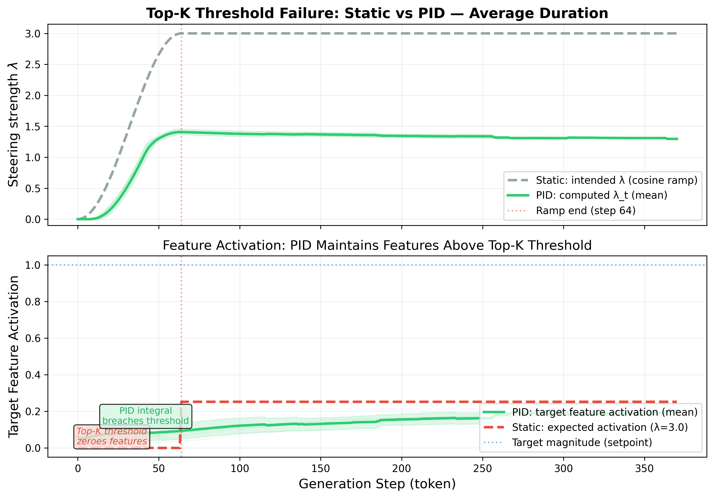

<script type="text/javascript" async src="https://cdnjs.cloudflare.com/ajax/libs/mathjax/3.2.2/es5/tex-mml-chtml.min.js"> </script>
<style>
  audio { width: 100%; max-width: 360px; }
  .audio-grid { display: grid; grid-template-columns: 1fr 1fr; gap: 16px; margin: 12px 0 24px 0; }
  .audio-cell { background: #f6f8fa; border-radius: 8px; padding: 12px; text-align: center; }
  .audio-cell strong { display: block; margin-bottom: 6px; font-size: 0.9em; }
  .audio-cell em { display: block; margin-bottom: 8px; font-size: 0.8em; color: #586069; }
  .results-table { width: 100%; border-collapse: collapse; margin: 12px 0; font-size: 0.9em; }
  .results-table th, .results-table td { padding: 8px 12px; border: 1px solid #d0d7de; text-align: center; }
  .results-table th { background: #f6f8fa; }
  .results-table tr:hover { background: #f6f8fa; }
  .highlight-row { background: #dafbe1 !important; }
  h3 { margin-top: 32px; }
  .section-divider { border: none; border-top: 2px solid #d0d7de; margin: 40px 0; }
  .pipeline-figure { text-align: center; margin: 24px 0; }
  .pipeline-figure img { max-width: 100%; border: 1px solid #d0d7de; border-radius: 8px; }
</style>

# Closing the Loop: PID Feedback Control for Interpretable Activation Steering in Symbolic Music Generation

**Authors**: Ioannis Prokopiou (1,2), Pantelis Vikatos (2), Maximos Kaliakatsos-Papakostas (3), Theodoros Giannakopoulos (4), Themos Stafylakis (1,5) [cite: 2, 3]
**Affiliations**: 
1 Athens University of Economics and Business &nbsp;&nbsp;2 Orfium Research &nbsp;&nbsp;3 Hellenic Mediterranean University &nbsp;&nbsp;4 NCSR "Demokritos" &nbsp;&nbsp;5 Archimedes / Athena Research Center [cite: 12]

*Accepted at the 43rd International Conference on Machine Learning (ICML 2026), Seoul, South Korea.* [cite: 14]

[💻 Code Repository](#code) | [🎵 Audio Examples](#audio-examples)

---

## Abstract
Activation steering controls generation at inference without retraining[cite: 5]. In symbolic music, Sparse Activation Steering via Sparse Autoencoders enables interpretable single-layer attribute control but fails in temporal smoothing: fractional steering magnitudes fall below the Top-K sparsity threshold, zeroing the intervention[cite: 5]. We propose PID Steering in two forms: Spatial PID validates control-theoretic steering in the generative music domain, while Temporal PID dynamically adjusts $\lambda(t)$ at each autoregressive step via a closed-loop controller whose integral term accumulates error to overcome the Top-K barrier[cite: 6]. Experiments on the Multitrack Music Transformer show that Temporal PID overcomes the Top-K threshold failure for pitch and duration steering, enabling smooth transitions with less intervention strength and 5% lower Fréchet Music Distance versus static SAS[cite: 7].

---

## The Top-K Threshold Problem
During a gradual cosine ramp, fractional $\lambda$ values from 0 to a target value are too small to enter the top-K, entirely zeroing the steering signal and forcing an abrupt binary transition instead of a smooth one[cite: 19]. 

<div class="pipeline-figure">
  
  <figcaption>Figure 1: Static ramping zeros target features throughout the ramp. PID's integral accumulation maintains non-zero activations from the onset. [cite: 60]</figcaption>
</div>

---

## Methodology

### Spatial PID
Validates the layer-wise PID formulation on the MMT's 12 sublayers[cite: 22]. The steering vector $u(k)$ at each layer $k$ is computed as[cite: 41]:

$$ u(k) = K_{p}e(k) + K_{i}\sum_{j=0}^{k-1}e(j) + K_{d}(e(k) - e(k-1)) $$

### Temporal PID
Transposes PID control from the spatial to the temporal domain, built around a Top-K-aware error signal[cite: 23]. At each generation step $t$, the controller measures whether steered features survive re-sparsification and adapts $\lambda(t)$[cite: 23]. 

$$ \lambda(t) = clamp(K_{p}e(t) + K_{i}I(t-1) + K_{d}(e(t) - e(t-1))) $$

where $I(t)$ is the integral accumulator with anti-windup clamping[cite: 83]. The steered sparse representation becomes[cite: 85]:

$$ \tilde{a}_{t}^{l} = \hat{a}^{l}(\sigma(f(a_{t}^{l}) + \lambda(t) \cdot v)) + \Delta $$

---

## Experimental Results

### Single-Concept Temporal PID Steering
For pitch-up steering, PID achieves 72.65 semitones versus static SAS 72.30, using 62% less intervention (avg $\lambda=1.15$)[cite: 114]. PID achieves 5.3% lower FMD than static SAS for pitch[cite: 128].

<table class="results-table">
  <tr>
    <th>Concept</th>
    <th>Direction</th>
    <th>PID</th>
    <th>Static</th>
    <th>Base.</th>
  </tr>
  <tr class="highlight-row">
    <td>Pitch (st)</td>
    <td>↑ <br> ↓</td>
    <td>72.65 <br> 43.99</td>
    <td>72.30 <br> 44.91</td>
    <td>68.79 <br> 67.94</td>
  </tr>
  <tr>
    <td>Dur. (ticks)</td>
    <td>↓</td>
    <td>18.87 <br> 4.23</td>
    <td>22.17 <br> 3.35</td>
    <td>7.99 <br> 7.72</td>
  </tr>
</table>
*Table 1: Single-concept steering ($n=40$). [cite: 118, 121]*

### Dual-Concept Conditioned Steering
PID evaluates simultaneous pitch and duration steering using two independent temporal PID controllers[cite: 136]. It achieves 4.7 lower degradation in unconditioned steering ($\delta=0.47$ vs. 2.19) and excels in the hardest opposing-direction conditioned case[cite: 138].

<table class="results-table">
  <tr>
    <th>Scenario</th>
    <th>PID $\delta$</th>
    <th>Static $\delta$</th>
    <th>PID Success</th>
    <th>Static Success</th>
  </tr>
  <tr>
    <td>Uncond. L/S</td>
    <td>0.47</td>
    <td>2.19</td>
    <td>90%</td>
    <td>95%</td>
  </tr>
  <tr class="highlight-row">
    <td>H/S &rarr; L/L</td>
    <td>1.92</td>
    <td>4.30</td>
    <td>100%</td>
    <td>100%</td>
  </tr>
  <tr>
    <td>H/L &rarr; L/S</td>
    <td>5.21</td>
    <td>3.61</td>
    <td>95%</td>
    <td>90%</td>
  </tr>
</table>
*Table 2: Dual-concept condition steering ($n=20$). [cite: 120, 122]*

### Round-Trip Steering
Temporal PID enables reversible steering: steer away from a conditioned prefix, hold, then steer back[cite: 144]. PID outperforms a passive release baseline ($\lambda=0$) by 8-26 percentage points (aggregate recovery: 46-74% vs. 36-62%)[cite: 144].

---

<h2 id="audio-examples">🎵 Audio Examples</h2>

### Single Attribute — Pitch

<div class="audio-grid">
  <div class="audio-cell">
    <strong>PID: Pitch Up</strong>
    <em>Dynamic λ overcomes Top-K threshold</em>
    <audio controls src="assets/audio/samples/pid_pitch_up.mp3"></audio>
  </div>
  <div class="audio-cell">
    <strong>Static SAS: Pitch Up</strong>
    <em>Abrupt threshold jump</em>
    <audio controls src="assets/audio/samples/static_pitch_up.mp3"></audio>
  </div>
</div>

### Dual Steering & Round-Trip

<div class="audio-grid">
  <div class="audio-cell">
    <strong>PID Dual Steering</strong>
    <em>Simultaneous pitch and duration adaptation</em>
    <audio controls src="assets/audio/samples/pid_dual_cond.mp3"></audio>
  </div>
  <div class="audio-cell">
    <strong>PID Round-Trip</strong>
    <em>Active recovery back-steering</em>
    <audio controls src="assets/audio/samples/round_trip_pid.mp3"></audio>
  </div>
</div>

*(Please replace audio sources with your actual filenames)*

---

<h2 id="code">💻 Code & Reproducibility</h2>
Code and pre-trained SAEs are available in our primary GitHub repository. Running Temporal PID only adds a +1.9% marginal overhead versus static SAS[cite: 361].

```bash
# Generate with Temporal PID (Pitch)
python sparse_steering/steered_generator_sas.py \
    --concept average_pitch \
    --controller pid \
    --kp 1.0 --ki 0.05 --kd 0.01 \
    --layer 10